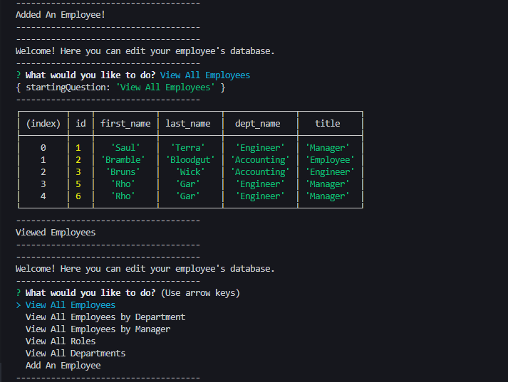

# FULL-Employee-Tracker

## Description
A small command line application that allows the user to track data baout their employees. It tracks the employee names, their id, their department, their role, and allows you to update and delete the data.
  
## Table Of Contents
* [Installation](#Installation)
* [Usage](#Usage)
* [Contributers](#Contributors)
* [Tests](#Tests)
* [License](#License)
* [Questions](#Questions)
  
## Installation
Install files through github and then run npm install !

  
## Usage
Used to create an employee databases.
  
## Contributors
Sami Sully and Georgia Tech Bootcamp Students and Staff for teaching me to write this!

(https://www.github.com/SamiSully)

NODE.JS, JQUERY, EXPRESS, mySQL, INQUIRER
  
## Tests
Tested multiple times locally via running different commands to add departments, roles, and employees.
  
## License
MIT License

(https://choosealicense.com/licenses/mit/)

Copyright © Sami Sully 2020
  
## Questions
If you have any questions, you can reach out to me directly at samilsuly@gmail.com
  